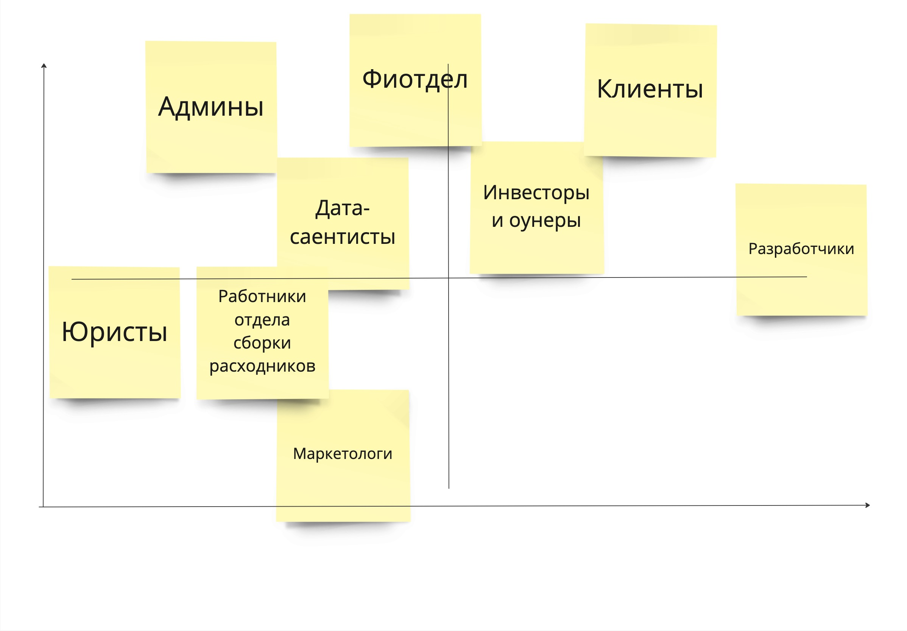
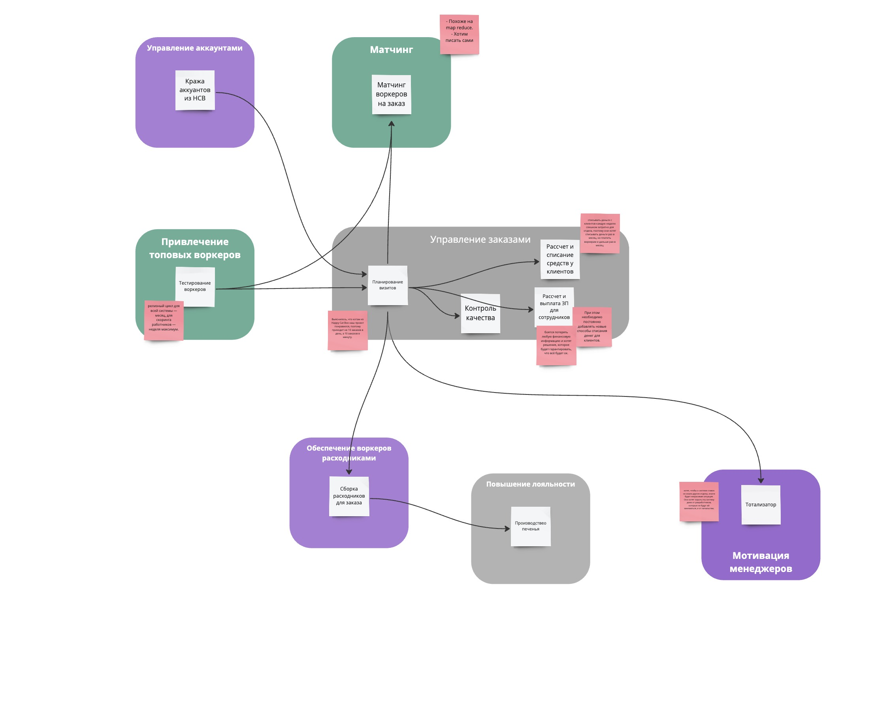
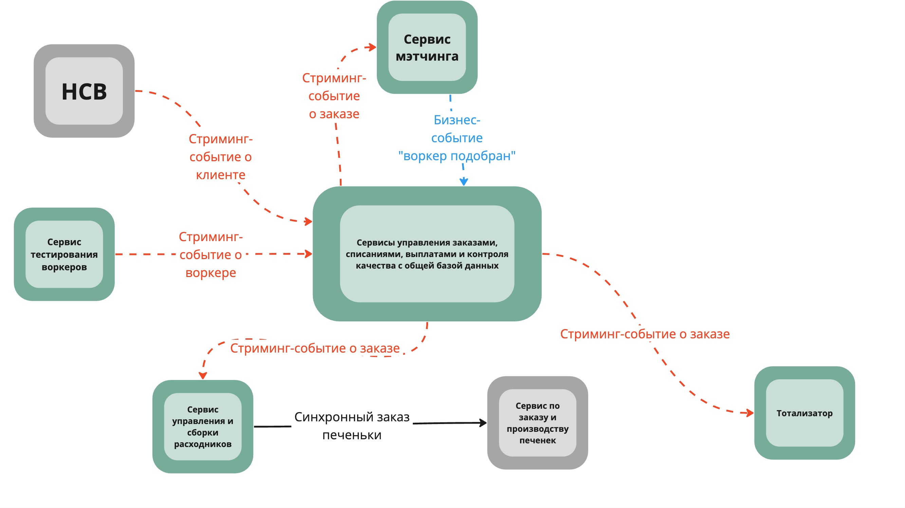

## Homework 3

### Матрица стейкхолдеров

### Архитектурный стиль

Решено выбрать распределенные стиль, потому что
1. Сервису привлечения воркеров нужен свой релизный цикл, гораздо меньше, чем всей системе
2. В управлении заказами ожидается нагрузка гораздо выше, чем ожидалась изначально, хорошо бы уметь независимо скейлить сервисы, которые за это отвечают.
3. В контексте матчинга сложные алгоритмы, а также явно напрашивающийся pipeline архитектурный стиль, который не нужен в других контекстах.
4. Тотализатор необходимо скрыть от разработчиков, которые над ним не работают, поэтому он уносится в отдельный сервис куда подальше. Также коммуникация с этим серисом будет асинхронной, чтобы другие разработчики не увидели вызовов. Тотализатор просто подпишется на топик с изменения по заказам (как и многие другие сервисы).
5. Обеспечение воркеров расходниками просто очень хорошо изолируется и вынесем в отдельный сервис, чтобы система была более цельной.
6. 4 контекста в управлении заказами можно сделать 4-мя сервисами в Service-Based архитектурном стиле с единой базой. Это очень удобно, так как всем этим сервисам нужна сильная консистентность всего состояния заказа, они могут его шерить через базу. База скорее всего будет реляционная.

### Базы данных

**Управление заказами**
RDBMS на 4 сервиса гарантирует консистентность данных между сервисами, также для выплат и списаний важна транзакционность.

**Мэтчинг**
Тут pipeline архитектура и слаботипизированные и неструктурированные  данные, подойдёт графовая база данных.

**Тотализатор**
Здесь тож нужна консистентность, а также чтоб правильно рассчитать выигрыш не помешает транзакционность, подойдет RDBMS.

**Тестирование воркеров**
Тут хорошо подойдет документориентированная база, в ней удобно будет хранить всю информацию и характеристики вокеров одним документом, при этом структура документа будет гибкой, и поддерживать произвольную схему. Это поможет нам менять алгоритмы и экспериментировать меняя схему документа с характеритиками.

**Обеспечение раходниками**
Для сервиса обеспечения важна consistency, поэтому им подойдёт изолированная RDBMS;

### Коммуникации

