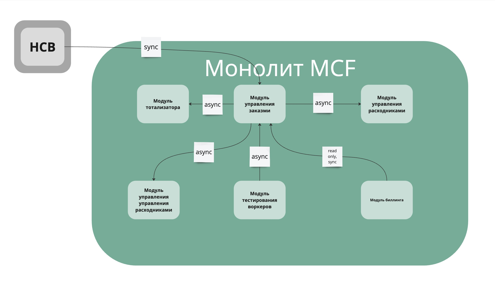
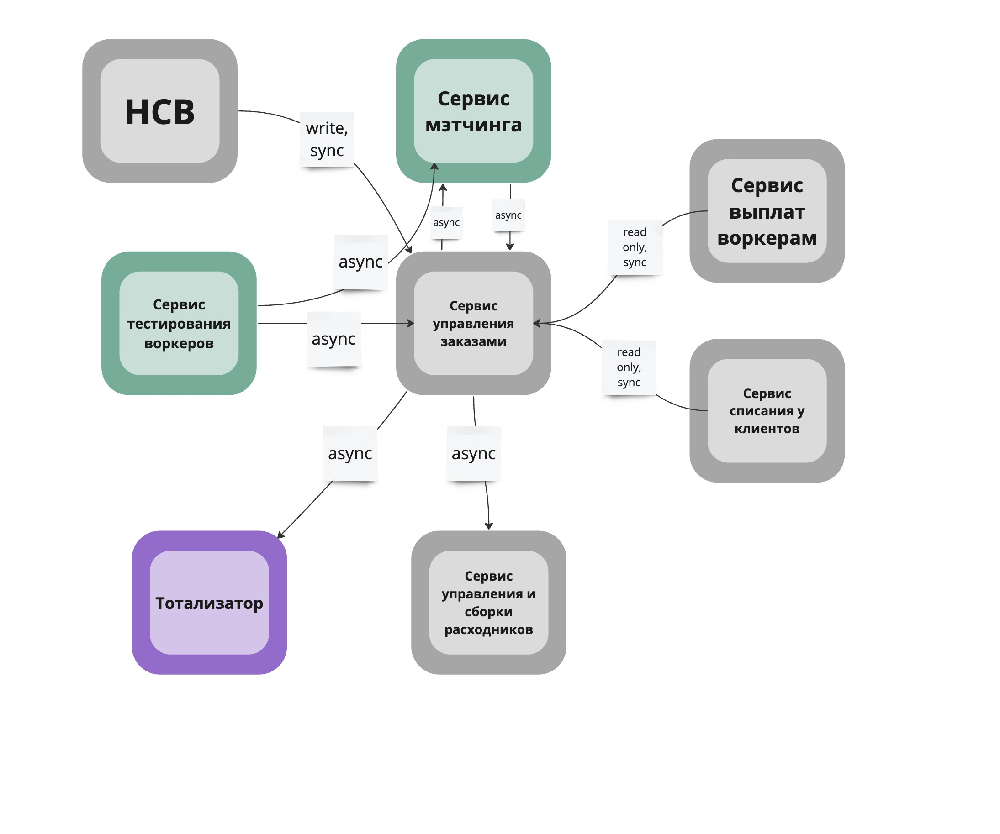

## Homework 4

### Мой монолит из первого урока

### Изменения
1. Модуль управления заказами должен выехать из монолита и разделиться на 2 сервиса: сервис управления заказами и сервис матчинга заказов на воркеров.
2. Модуль тотализатора должне отъехать в отдельный сервис.
3. Модуль биллинга должен стать двумя отдельными сервисами: выплаты воркерам и списания оплат за заказы.
4. Модуль управления расходниками должен стать изолированным сервисом.
5. Модуль тестирования воркеров должен стать изолированным сервисом и назваться "привлечение воркеров".

### План распила монолита
**когда свободных людей и ресурсов нет, а опыт и (или) инфраструктура есть**
1. Сразу начинаем с выноса core-поддомена "мэтчинг воркеров на заказы". У него будет две входящих связи: стриминг заказов и стриминг воркеров, а исходящей связью будет доменное событие: воркер X подобран на заказ Y.
2. Затем важно вынести второй core-поддомен в отдельный сервис: сервис тестирования воркеров. Он будет мастер-системой по хранению воркеров и будет стримить их в модуль управления заказами (который пока в монолите) и сервис матчинга. Тут мы захотим поменять хранилище на документо-ориентированное, то используем подход Change Data Capture.
3. Тут в одном шаге объединю выделение сервисов выплат воркерам и списаний у клиентов, они хоть и не core, но оба должны подходить под комплаенс. Значит пока они в монолите, к монолиту предъявляются повышенные требования, а это дорого. Можно выносить в любом порядке. Посколку код в монолите уже соответсвует комплаенся (надеюсь), можно использовать Takctical Forking для обоих сервисов.
4. Тут давайте отдохнем, а то команда выгарает, синьеры давно в отпуске не были, а мидлы и джуны уже поняли, как выносить сервисы. Давайте вынесем тотализатор, потому что его важно скрыть с глаз долой, как можно быстрее, а все более критичное мы уже закончили. Он простой, его можно написать с нуля, будет быстрее, поэтому используем Strangler Fig Application.
5. Осталось вынетси сервис управления расходниками, ну или просто монолит в него переименуем, потому что только этот модуль и остался в монолите.

### План распила монолита
**когда есть свободные люди и ресурсы, а опыта и (или) инфраструктуры нет**
1. Начинаем с support поддоменов, выносим тотализатор. Он простой, обкатаем навыки или инфраструктуру и быстро скроем с глаз этот неугодный код.
2. Дальше, чтоб набраться опыта выносим сервис управления расходниками.
3. Набрались опыта, теперь давайте форкнем монолит и сделаем сервисы, которые под комплаенсом: выплат воркерам и списаний у клиентов. Тем более у них не много связей, только синхронные запросы в монолит за заказами (специльно делаю синхронными, потому что тут важна не потерять ни одного заказа).
4. Дальше выносим сервис тестирования воркеров. Из двух оставшихся core-поддоменов, он чуть более простой. Подход CDC.
5. Выносим матчинг в отдельный сервис, в монолите остается только управление заказами.

### Итоговая схема микросервисов

- Instability сервиса мэтчинга: ...
- Instability сервиса управления заказами: ...

